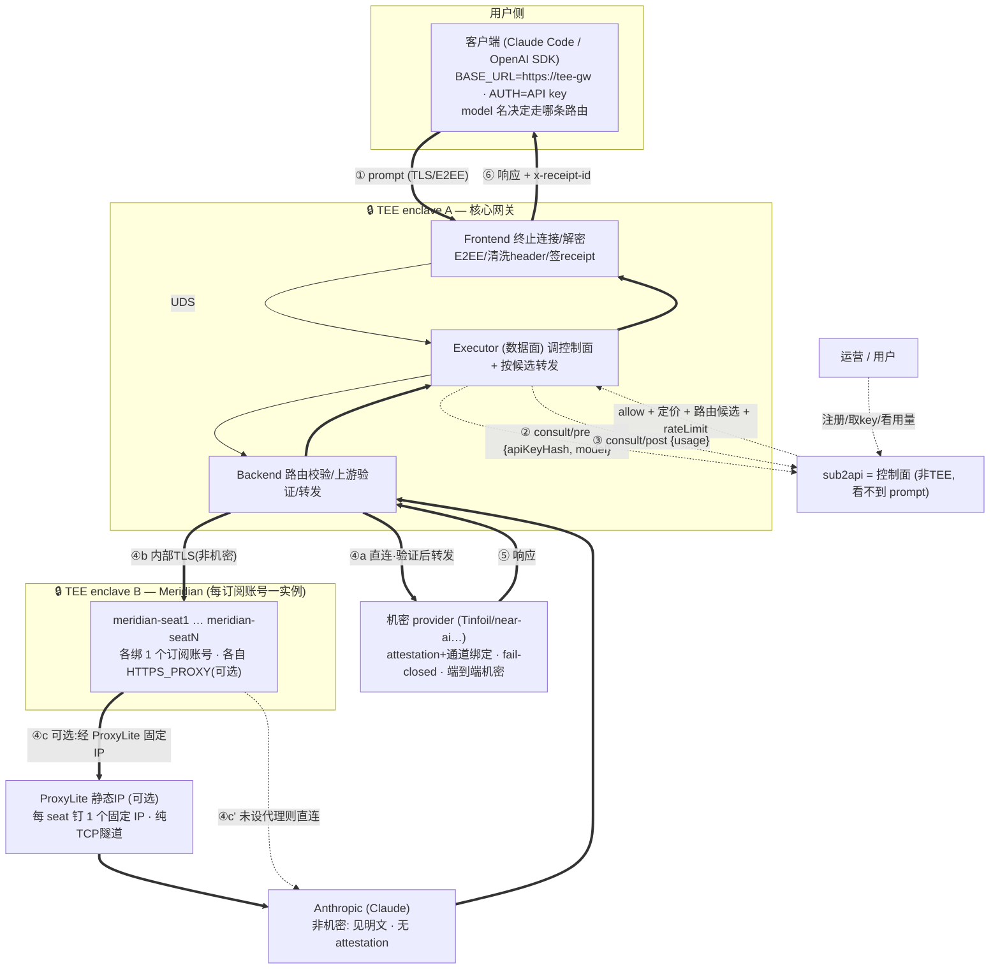

# ApexOne 架构方案

本文介绍 ApexOne 推理平台的整体架构：如何在**不让中转基础设施接触用户明文**的前提下，
把多种上游模型（机密 provider、Claude 订阅、原始付费 API）统一成一个可计费、可管控的 API 服务。

---

## 1. 总览

ApexOne 由三层组成：

- **控制面（sub2api，非 TEE）**：发放/校验 API key，管理账号、team、配额、限速、计费与后台。
  只接触请求**元数据**（key 哈希、模型名、token 计数），**永远看不到 prompt/响应**。
- **数据面核心（private-ai-gateway，TEE enclave A）**：用户明文的**唯一入口**。
  在机密 enclave 内解密、按控制面返回的候选路由转发；对机密上游做远程验证 + 通道绑定 + fail-closed。
- **Meridian 桥接（TEE enclave B，可多实例）**：把 Claude 订阅账号桥接成 Anthropic 兼容端点，
  使 Claude 路由可用订阅额度承载。独立部署、独立度量，运行时明文同样只在 enclave 内。

出口侧另有一个**可选**组件 **ProxyLite**（TEE 外的静态住宅/ISP 代理），
用于给指定的 Claude 订阅出口固定一个 IP。

---

## 2. 组件职责

| 组件 | 位置 | 职责 | 可见 prompt |
|---|---|---|---|
| **sub2api** | 非 TEE | 控制面：key、账号/team/配额、限速、计费、Admin+DB、选路授权 | ❌ 永不 |
| **private-ai-gateway** | TEE enclave A | 数据面核心：解密、按候选转发、机密上游验证与 fail-closed、签发 receipt | ✅ 仅 enclave 内 |
| **Meridian** | TEE enclave B（每订阅账号一实例） | 将 Claude 订阅桥成 Anthropic 兼容 API；仅服务 Claude 路由 | ✅ 仅 enclave 内 |
| **ProxyLite** | TEE 外（可选） | 为指定订阅出口钉一个静态 IP；纯 TCP 隧道，只见密文与目标 SNI | ❌ 见不到明文 |

---

## 3. 数据流

> **粗线 = 数据面**：prompt/响应，只经 TEE 与上游。
> **虚线 = 控制面**：只走元数据 `{apiKeyHash, model, usage}`，不携带任何 prompt/响应内容。

请求时序：

1. 客户端用 API key 直连网关 frontend，发送请求（TLS，可选 E2EE）。
2. Executor 向 sub2api `POST /consult/pre`（带 `{apiKeyHash, model}`）请求授权与路由候选。
3. sub2api 校验 key/配额/限速，按 route_map 解析出候选路由（`routeId + format`）并回传定价。
4. Backend 按候选转发：
   - **机密 provider**：验证真 TEE + 通道绑定，失败则 **fail-closed 不转发**，receipt 带 attestation。
   - **Claude（经 Meridian）**：内部 TLS 转发给对应 Meridian 实例，由其调用 Anthropic。
5. 响应原路返回，frontend 完成 E2EE（如启用）并签发 receipt（`x-receipt-id`）。
6. Executor 向 sub2api `POST /consult/post` 上报用量（fire-and-forget）用于计费。

---

## 4. 控制面 / 数据面分离

| | 数据面 | 控制面 |
|---|---|---|
| 内容 | prompt / 响应（明文或 E2EE） | `{apiKeyHash, model}` + 用量计数 |
| 路径 | 仅 TEE ↔ 上游 | TEE executor ↔ sub2api |
| 是否含 prompt | 是 | **否（结构上就不携带）** |

只有 API key 的 **SHA-256 哈希**跨到控制面；原始 key、prompt、响应都不出 TEE。
sub2api 是唯一的**授权 + 选路权威**：网关不自行决定路由，每个请求都要经 `consult/pre`。

---

## 5. 路由分档

平台支持三类路由，由客户端请求的 model 名经 sub2api route_map 决定：

| 路由 | 上游 | 机密性 | attestation | 承载方式 |
|---|---|---|---|---|
| **机密 provider** | Tinfoil / near-ai 等 | ✅ 端到端 | ✅ receipt 带 | 直连，验证 + fail-closed |
| **Claude（订阅）** | Anthropic（经 Meridian） | ❌ Anthropic 见明文 | ❌ 无 | 订阅额度，可选 ProxyLite 固定 IP |
| **原始付费 API**（可选） | OpenAI / Anthropic 官方 API | ❌ | ❌ | 直连按量 |

各路由**相互隔离**：新增或调整某一路由（如 Claude 订阅）不影响其它路由；
机密 provider 的验证、通道绑定、fail-closed 行为始终不变。

---

## 6. Meridian（Claude 订阅桥接）

- Meridian 把一个 Claude 订阅账号封装成标准 Anthropic 兼容端点（`/v1/messages`），
  网关将其视为一条普通的非机密上游。
- **一个订阅账号 = 一个 Meridian 容器（seat）= 网关中的一条上游**（进程级代理决定
  「每账号独立出口 IP」须一账号一容器）。多 seat 由 sub2api 在控制面选路池化，用于
  分散/叠加单账号的速率上限。
- **成本优化**：seat 空闲仅 ~60MB，瓶颈是并发不是账号数——可把 **N 个 seat 容器打包进
  一个 CVM**（`gen-seats.sh` 生成，各容器独立 API key/IP/持久卷），比「一账号一 CVM」省
  数倍；30 账号单机约 tdx.xlarge。网关与 Meridian 各自独立 CVM，网关 attested 身份稳定，
  加/换 seat 靠 `PUT /v1/admin/upstreams` 热加载不动网关。
- Claude 订阅登录态仅存在于 enclave B 内（经 dstack sealed env 注入 + 持久卷保存刷新态），
  网关与 sub2api 都不持有。**同一账号只能一个消费者**（凭证 refresh token 单次轮换，多处
  共享会互相踢下线）。
- **生产 OS**：enclave 必须跑生产 OS（`is_dev=false`、无 SSH）attestation 才是有效安全证明；
  OS 建 CVM 时固定、不能原地切（详见 `production-deployment.md` §7.1）。
- 该路由对 **Anthropic 是非机密**的：Anthropic 侧可见明文，receipt 不含 attestation。
  其安全保证是「除 Anthropic 外，任何中转方（含平台运维、sub2api）都看不到内容」。

---

## 7. ProxyLite（可选出口固定 IP）

- 作用：为指定的 Claude 订阅 seat 固定一个静态住宅/ISP 出口 IP，使该账号长期从同一 IP 出网。
- 实现：在对应 Meridian 实例内设置 `HTTPS_PROXY`。**完全可选、每 seat 独立、纯部署开关**：
  - 设置 → 该 seat 经 ProxyLite 固定 IP 出网；
  - 不设置 → 该 seat 直连 Anthropic（用 enclave 自身 IP）。
- ProxyLite 作为纯 TCP 隧道，只经手 TLS 密文与目标 SNI，**看不到 prompt 明文**。
- 使用原则：**一 seat 钉一个固定 IP、保持稳定**（续期沿用同一 IP），而非高频轮换。

---

## 8. 安全边界

1. **明文只在 TEE enclave 内**（enclave A 与 B 都是 TEE）；sub2api、ProxyLite、平台中转机均看不到 prompt。
2. **凭证隔离**：Claude 订阅登录态在 enclave B、上游凭证在 enclave A、ProxyLite 账号随对应 Meridian 实例；
   均不进入控制面。
3. **机密路由端到端可验证**：走机密 provider 时 receipt 带 attestation，验证失败即 fail-closed 不转发。
4. **机密性分档透明**：机密 provider 路由端到端机密；Claude/原始 API 路由对模型方非机密（模型方见明文）——
   由 receipt 是否带 attestation 区分，需向使用方明确告知。

---

## 9. 关键配置与接口

- **控制面接口**（sub2api 实现，executor 调用）：
  - `POST /consult/pre` — 请求前授权 + 返回路由候选与定价。
  - `POST /consult/post` — 请求后上报用量（计费）。
  - `GET  /models` — 从 route_map 生成的模型目录。
- **路由映射**：`consult.route_map`，形如 `model → { route_id: "<upstream>:<model>", format }`。
  `route_id` 的 `<upstream>` 必须与网关 `upstreams.json` 中的上游名一致。
- **上游配置**（网关 `upstreams.json`）：每个上游含 `name / provider / base_url / path / models / bearer_token`
  及各机密 provider 的验证策略。Meridian seat 用 `provider: openai-compatible` + `path: /v1/messages`。
- **客户端接入**：`ANTHROPIC_BASE_URL = <网关地址>`，`ANTHROPIC_AUTH_TOKEN = <sub2api 发放的 key>`，
  用 model 名选择路由。
