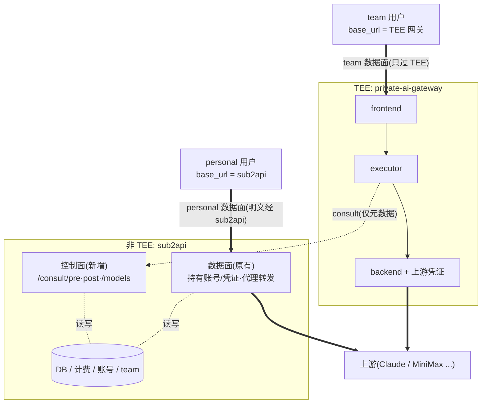

# 技术方案:sub2api 对接 private-ai-gateway(TEE 控制面,基础版)

## Context(为什么做这件事)

sub2api 分两种模式,数据走**不同路径**:

- **personal 模式(不走 TEE)**:沿用 sub2api **原有数据面**——sub2api 自己持有上游账号/凭证,直接代理转发到上游。prompt 经过 sub2api。客户端 `base_url` 指向 **sub2api**。
- **team 模式(走 TEE)**:team 用户的请求只经过 **TEE 网关**(private-ai-gateway)。客户端 `base_url` 指向 **TEE 网关**;网关内的 executor 通过 consult 调用 sub2api 做鉴权/路由/计费,sub2api **只接触元数据**(`apiKeyHash`、model、token 计数),**不接触 prompt**。

本方案要做的就是给 **team 模式**补上 sub2api 侧的 consult 控制面;**personal 模式的现有数据面保持不变**。

team 模式利用 private-ai-gateway 的**控制面/数据面分离**:

- **数据面**(prompt/响应、上游凭证、转发)全部在 TEE 网关 + executor 内。
- **控制面**(鉴权、路由决策、计费)交给 sub2api,且只接触请求**元数据**,**不接触 prompt**。

网关侧(Rust)和 executor(TS 中间件)已经实现完整,且 executor 已内置 consult 客户端(`middleware/executor/src/integrations/control.ts`),会调用三个**固定**接口。**本方案只在 sub2api 侧开发这三个接口 + 模式区分**。

范围:**仅基础 consult**(不含 BYOK)。

---

## 双模式与路由(personal=非 TEE / team=TEE)



> 粗线 = 数据面。personal 的 prompt 经过 sub2api;team 的 prompt 只过 TEE,sub2api 只收到元数据。

**模式判定与互斥隔离:**

| | personal 模式 | team 模式 |
|---|---|---|
| 判定 | key **无 `team_id`** | key **有 `team_id`**(或归属"走 TEE"的 group) |
| 客户端 base_url | 指向 **sub2api** | 指向 **TEE 网关** |
| 数据面 | sub2api 原有代理(**不改**) | TEE 网关独占 |
| sub2api 角色 | 数据面 + 计费 | 仅控制面(consult)+ 计费 |
| 隔离 | sub2api 自身 `/v1` 代理对 **team key 拒绝**(强制走 TEE) | consult 对 **非 team key 拒绝** |

> 即:两类 key 互斥——team key 只能走 TEE(经 consult),personal key 只能走 sub2api 自身代理。

---

## 待你确认的 3 个关键决策(我已给推荐)

| # | 决策 | 推荐 | 备选 |
|---|---|---|---|
| B | key 哈希查找(executor 只发 `sha256(key)`,sub2api 现明文存) | **加 ent 列 `key_hash` + 迁移 + 回填**(稳健、合现有模式) | Redis 内存映射(免迁移、较脆) |
| C | 用量计费落地(`RecordUsage` 强制要 `AccountID`,TEE 上游不在 sub2api) | **建一个占位 account 行 + 复用 `RecordUsage`**(复用计费/配额/余额/限速全链路) | 轻量直写 `usage_log` |
| D | sub2api 角色 | **双模式共存**:personal=原有数据面(非 TEE);team=仅控制面(consult,走 TEE)。用 `team_id` 区分,两类 key 互斥隔离 | 纯控制面(全部走 TEE) |

后文按推荐方案展开。若你改某项,对应小节会调整。

---

## 对接契约(executor 端固定,sub2api 必须严格匹配)

来源:`middleware/executor/src/integrations/control.ts`。鉴权:executor 发 `Authorization: Bearer <PRIVATE_AI_GATEWAY_CONTROL_TOKEN>`。

### `POST /consult/pre`
请求:`{ apiKeyHash: string, model: string, provider?: {only?,order?,allow_fallbacks?} }`
放行响应:
```json
{ "allow": true,
  "candidates": [{ "routeId": "<upstream名>:<public model id>", "format": "openai|anthropic", "engine": "sglang|vllm(可选)" }],
  "pricing": { ... 或 null },
  "userId": <int>, "virtualKeyId": <int>, "spendMode": "regular",
  "userTier": "<可选>", "rateLimit": { "limit": <int>, "resetAt": <unix秒> } }
```
拒绝响应:`{ "allow": false, "status": <http码>, "message": "<原样回客户端>" }`

### `POST /consult/post`(fire-and-forget)
请求(关键字段):`{ requestId, endpoint, status, durationMs, ttftMs?, isStreaming?, selectedRouteId, requestModel, usage:{prompt_tokens,completion_tokens,...}|null, pricing, spendMode?, userId?, virtualKeyId? }`
响应:`{ "ok": true }`

### `GET /models`
响应:`{ "object": "list", "data": [{ "id": "<model>", "object": "model" }] }`

---

## sub2api 侧改动(基础版)

代码根:`backend/`(sub2api 仓库后端)

### 1. key 哈希查找(决策 B)
- **schema**:`ent/schema/api_key.go` 增 `field.String("key_hash").MaxLen(64).Optional().Nillable()`,并在 `Indexes()` 加 `index.Fields("key_hash")`。镜像现有 `key`/索引写法。
- **codegen**:`cd backend && make generate`(`ent/generate.go` 的 ent 代码生成)。
- **迁移**:新增 `migrations/NNN_add_api_key_key_hash.sql`:`ALTER TABLE api_keys ADD COLUMN IF NOT EXISTS key_hash varchar(64);` + `CREATE INDEX IF NOT EXISTS idx_api_keys_key_hash ON api_keys(key_hash) WHERE deleted_at IS NULL;`,并**回填存量**:`UPDATE api_keys SET key_hash = encode(digest(key,'sha256'),'hex') WHERE key_hash IS NULL;`(需 `pgcrypto`;否则回填用一次性脚本)。参考 `migrations/045_*.sql`、`064_*.sql`。
- **写入时维护**:在 `api_key_service.go` 的 `Create`(及任何改 key 的路径)里同时写 `key_hash = sha256(key)`。
- **repo 方法**:在 `repository/api_key_repo.go` 加 `GetByKeyHash(ctx, hash)`(镜像 `GetByKey`/`GetByKeyForAuth` 的 ent 查询,`Where(apikey.KeyHashEQ(hash))` + `WithUser/WithGroup`),并加进 `APIKeyRepository` 接口(`service/api_key.go`)。
- **service 方法**:在 `api_key_service.go` 加 `GetByKeyHash`(走与 `GetByKey` 一致的缓存/DB 路径)。

### 2. 抽出可复用的 key 校验
- 现有校验都在 `server/middleware/api_key_auth.go` 的 `apiKeyAuthWithSubscription`(状态/过期/配额/限速窗口/订阅/用户余额)。
- 抽出一个**不依赖 gin 的纯函数**(放 `service/` 或 `middleware/`):
  `ValidateAPIKey(ctx, apiKey *APIKey, sub *UserSubscription, cfg) (ok bool, httpStatus int, code, message string)`,内部复用 `APIKey.IsActive/IsExpired/IsQuotaExhausted`、`SubscriptionService.GetActiveSubscription`+`ValidateAndCheckLimits`、用户余额检查。
- 原中间件改为调用它(保持现有行为不变),consult/pre 也调用它。

### 3. consult 配置 + 模式区分(决策 D:双模式共存)
- `internal/config/config.go`:在 `Config` 加 `Consult ConsultConfig \`mapstructure:"consult"\``。
  ```go
  type ConsultConfig struct {
    ControlToken string                  `mapstructure:"control_token"`
    RouteMap     map[string]ConsultRoute `mapstructure:"route_map"`
  }
  type ConsultRoute struct {
    RouteID string `mapstructure:"route_id"` // <upstream名>:<public model id>,对齐网关 upstreams.json
    Format  string `mapstructure:"format"`   // openai | anthropic
    Engine  string `mapstructure:"engine"`   // 可选 sglang/vllm
  }
  ```
- `setDefaults()` 加 `viper.SetDefault("consult.control_token","")` 等。
- **route_map 是网关可服务模型的真相来源**(因为真实上游在网关,不是 sub2api 的 account)。

**模式区分(双模式共存):**
- **team 判定**:key 带 `team_id`(或归属"走 TEE"的 group)即视为 team 模式。建议在 `APIKey` 上加一个 `IsTeamMode()` 辅助(`k.TeamID != nil`),供 consult 与代理两侧共用。
- **consult 侧**:`/consult/pre` 只接受 team key;非 team key 返回 `{allow:false,status:403,message:"not a team key"}`。
- **代理侧(原有数据面)**:sub2api 自身 `/v1`(`server/routes/gateway.go` 的 `apiKeyAuth` 之后)对 **team key 拒绝**(强制走 TEE),避免 team 数据绕过 TEE。可在 `apiKeyAuthWithSubscription` 或网关 handler 入口加一道 `if apiKey.IsTeamMode() { 403 "use TEE endpoint" }`。
- personal key 行为完全不变。

### 4. 控制面 token 中间件
- 新增 `server/middleware/control_token_auth.go`:校验 `Authorization: Bearer <cfg.Consult.ControlToken>`(**注意是 Bearer,不是自定义头**),用 `subtle.ConstantTimeCompare`。token 为空时拒绝(503)。参考 `jwt_auth.go`/`admin_auth.go` 的 Bearer 解析写法。

### 5. consult handler + service
- 新增 `internal/handler/consult_handler.go`,struct 注入:`APIKeyService`、`SubscriptionService`、`PricingService`、`GatewayService`(用于 `RecordUsage`/`GetAvailableModels`)、`*config.Config`。构造函数 `NewConsultHandler(...)`。
- **`/consult/pre`**:
  1. `GetByKeyHash(apiKeyHash)` → 查不到 `{allow:false,status:401,message:"Invalid API key"}`。
  2. **模式校验**:`!apiKey.IsTeamMode()` → `{allow:false,status:403,message:"not a team key"}`(personal key 不允许走 TEE)。
  3. 载入订阅 → 调 `ValidateAPIKey(...)`;不通过则按返回的 status/code/message 回 `{allow:false,...}`。
  4. 由 `cfg.Consult.RouteMap[model]` 生成 candidates(若 group 配了 `ModelsListConfig` 则再做一次允许集过滤)。model 不在 route_map → `{allow:false,status:404,message:"Unknown model"}`。
  5. 定价:`PricingService.GetModelPricing(model)`(可直接透传,或返回 null 让 post 端重算)。
  6. 返回 `{allow:true, candidates, pricing, userId:APIKey.UserID, virtualKeyId:APIKey.ID, spendMode:"regular", rateLimit?}`。
- **`/consult/post`**(决策 C):
  1. 用 `userId/virtualKeyId` 重新载入 `APIKey`+`User`(或按 hash);用占位 `Account`(见下)。
  2. 由上报的 `usage` 构造 `ForwardResult{Usage: ClaudeUsage{InputTokens, OutputTokens, CacheRead/CreationTokens...}, Model: requestModel, ...}`。
  3. 调 `GatewayService.RecordUsage(ctx, &RecordUsageInput{Result, APIKey, User, Account: 占位, InboundEndpoint: endpoint, APIKeyService: apiKeyService, QuotaPlatform: PlatformFromAPIKey(apiKey)})` —— 复用其计费/余额扣减/apikey 配额/限速窗口/user×platform 配额全链路。
  4. 返回 `{ok:true}`(异步,失败不影响)。
- **占位 Account**:DB 里 seed 一行 `accounts`(如 name=`tee-gateway`,platform 按需),拿其 ID 注入;或加迁移插入。这样 `UsageLog.AccountID` 有合法外键、`ScheduleLastUsedUpdate` 不报错。
- **`/models`**:复用 `GatewayService.GetAvailableModels` 或直接列 `cfg.Consult.RouteMap` 的 key,输出 `{object:"list",data:[...]}`。

### 6. wire + 路由注册
- `internal/handler/wire.go`:`ProviderSet` 加 `NewConsultHandler`,并在 `Handlers` 结构体加 `Consult` 字段(参考 `ProvideHandlers`)。
- `server/middleware/wire.go`:如把中间件做成 provider,加 `NewControlTokenAuthMiddleware`;或在路由注册里直接 `middleware.ControlTokenAuth(cfg)`。
- 新增 `server/routes/consult.go` 的 `RegisterConsultRoutes(r, h, cfg)`:`g := r.Group("/api/control")`,挂 control-token 中间件,注册三路由(`/consult/pre`、`/consult/post`、`/models`)。
- `server/router.go` 的 `registerRoutes(...)` 调 `routes.RegisterConsultRoutes(r, h, cfg)`。
  - ⚠️ 路径前缀(实测踩坑):**必须挂在 `/api/` 下**(用 `/api/control`)。内嵌前端中间件(`internal/web`,`r.Use` 全局)只放行 `/api/`、`/v1/`、`/v1beta/`、`/backend-api/`、`/antigravity/` 等前缀;其余路径(含根路径 `/consult/*`、`/models`)会被 SPA 的 `index.html` 拦截返回 HTML。executor 端需设 `CONTROL_URL=<base>/api/control`,使其拼出的 `/consult/pre`、`/consult/post`、`/models` 落在 `/api/control/*`。

---

## 网关(private-ai-gateway)侧(仅配置,0 代码)

1. 网关静态 config 加 `executor` 段:`{"executor":{"uds_path":"/run/pag/executor.sock","backend_uds_path":"/run/pag/backend.sock"}}`。
2. 跑 executor 进程,env:`PRIVATE_AI_GATEWAY_EXECUTOR_UDS_PATH`/`PRIVATE_AI_GATEWAY_BACKEND_UDS_PATH`(对齐上面两个 UDS)、`PRIVATE_AI_GATEWAY_CONTROL_URL=https://<sub2api>/api/control`、`PRIVATE_AI_GATEWAY_CONTROL_TOKEN=<与 sub2api 一致>`。
3. 网关 `upstreams.json` 里配的 `<upstream名>:<public model id>` 必须与 sub2api `route_map[].route_id` 一一对齐。

---

## 验证(端到端)

1. **单元/构建**:`cd backend && make generate && go build ./...`;为 `ValidateAPIKey`、consult handler 写表驱动测试(参考现有 `*_test.go`)。
2. **本地链路(先用参考控制面验证 executor 链路通)**:按 `middleware/control` 跑通 gateway+executor;再把 executor 的 `CONTROL_URL` 指向新写的 sub2api consult。
3. **consult 契约自测**:
   - `curl -H "Authorization: Bearer <token>" -d '{"apiKeyHash":"<sha256>","model":"<m>"}' http://<sub2api>/api/control/consult/pre` → 看 `allow`/`candidates`。
   - 故意用无效 hash → `{allow:false,status:401}`。
4. **真实客户端**:Claude Code(`ANTHROPIC_BASE_URL`=网关,token=sub2api key)发请求 → 看 sub2api 日志 `/consult/pre` 命中、网关 backend 接受候选 routeId、`/consult/post` 写了 `usage_logs`、key 的 `quota_used`/余额被扣。
5. **隔离核对**:确认 prompt 不出现在 sub2api 侧任何日志/存储(数据只过 TEE)。

---

## 风险 / 注意

- **key 回填**:存量 key 必须回填 `key_hash`,否则老 key 在 consult 下查不到。
- **占位 account 外键**:务必先 seed `tee-gateway` account 行再上线 post。
- **路径前缀**:consult 三接口挂在 `/api/control`(必须在 `/api/` 下,否则被前端 SPA 中间件拦截返回 HTML);它们只走 `ControlTokenAuth`,不在 `/api/v1` 的 jwt/admin 鉴权链里。
- **format 来源**:以 `route_map` 显式 `format` 为准(不要依赖 Group.Platform 推断,避免和网关不一致)。
- **明文 key 安全**:本方案不改 key 的明文存储现状(只是加了哈希查找);如要彻底去明文,是独立的安全改造,不在本范围。
- **双模式互斥**:必须两侧都拦——consult 拒非 team key、sub2api 自身 /v1 代理拒 team key。任一侧漏判都会让 team 数据绕过 TEE(走进 sub2api 数据面),破坏"team 只过 TEE"的承诺。
- **客户端配置**:team 用户的 `base_url` 必须指向 TEE 网关、personal 指向 sub2api;发错端点时靠上面的互斥拦截兜底(返回 403 引导)。
